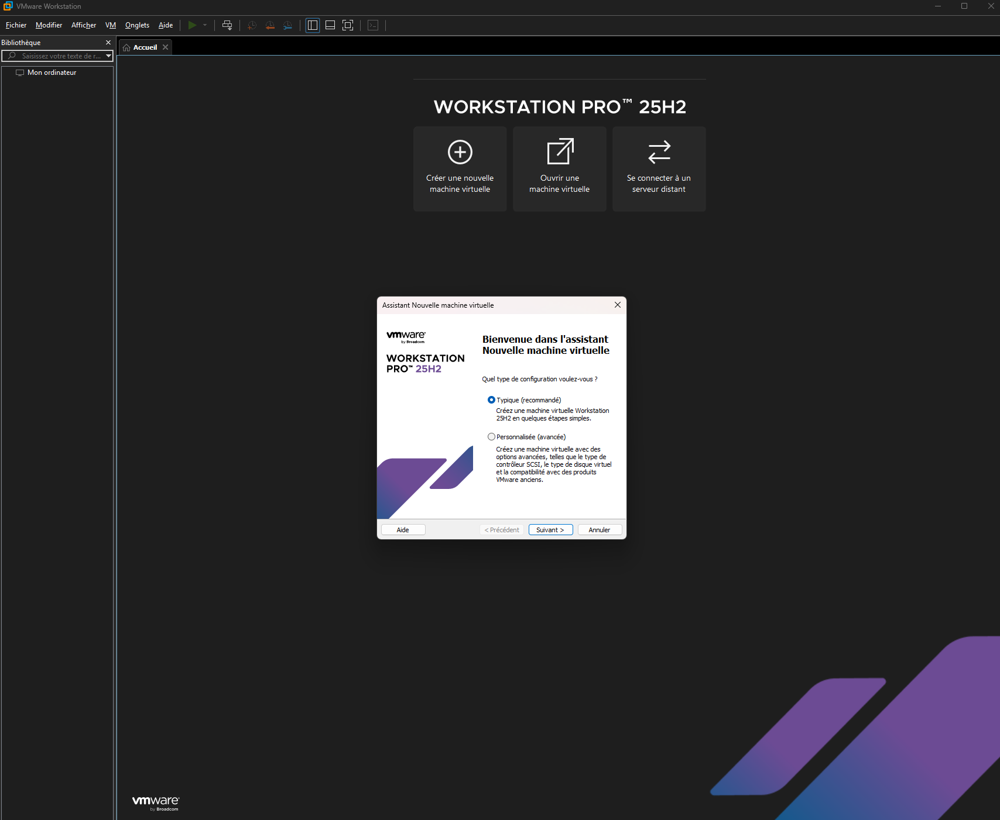
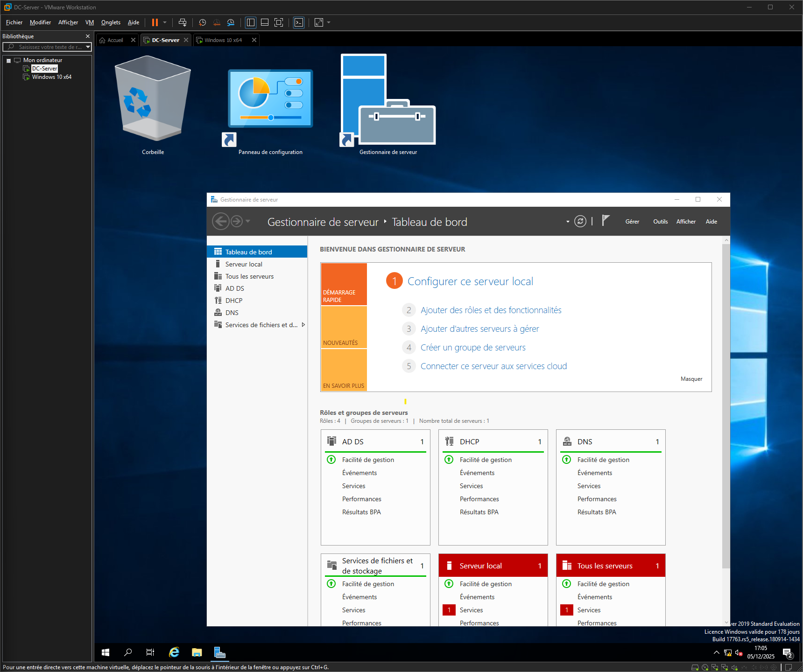
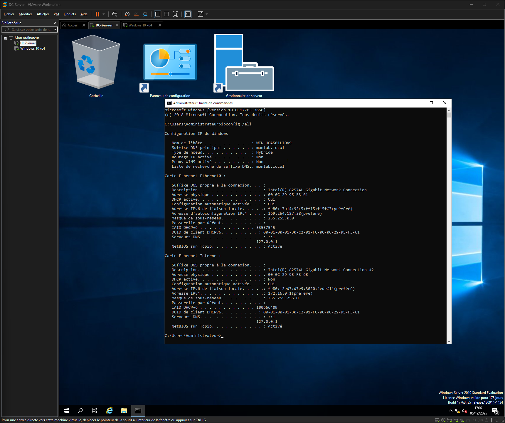
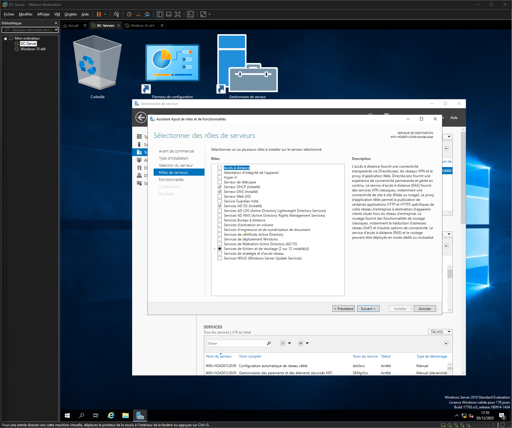
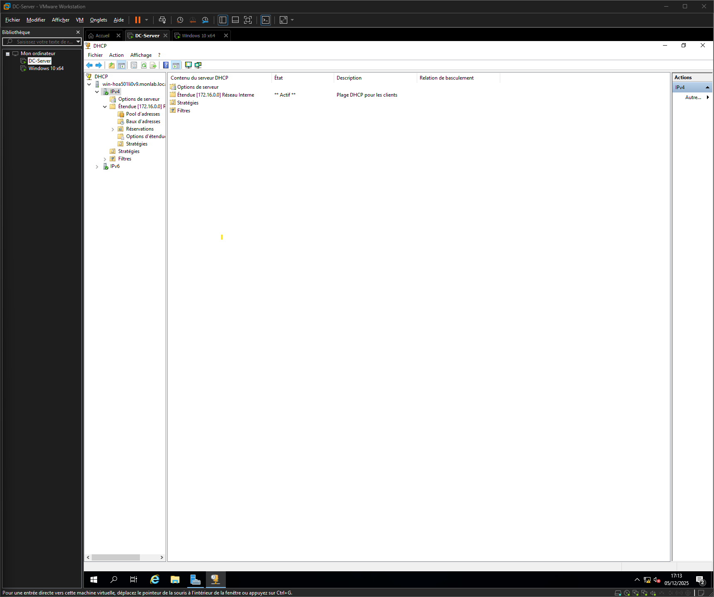
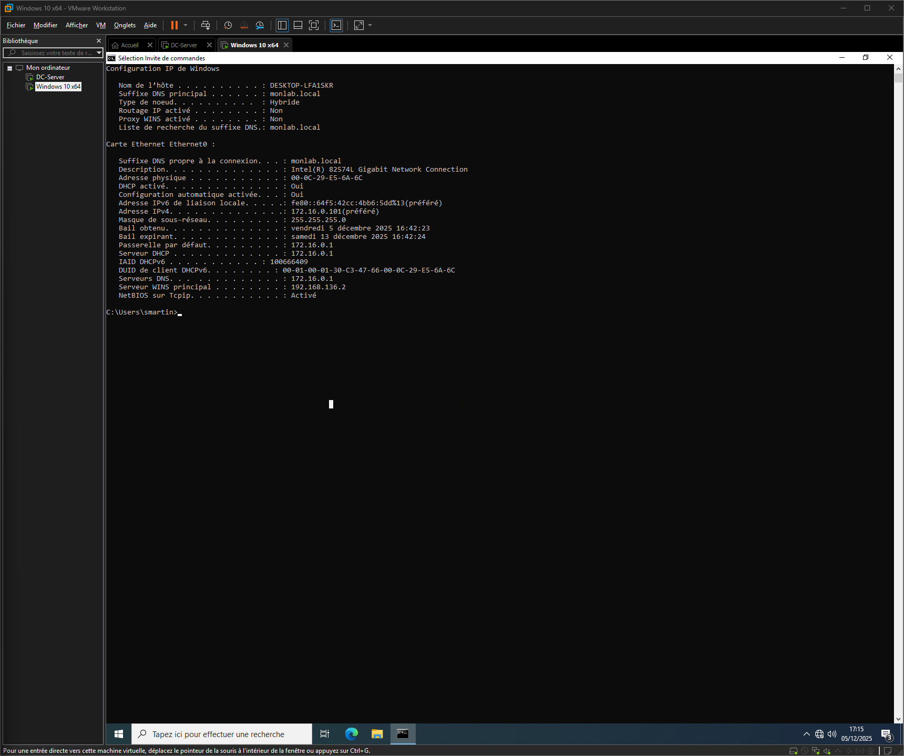
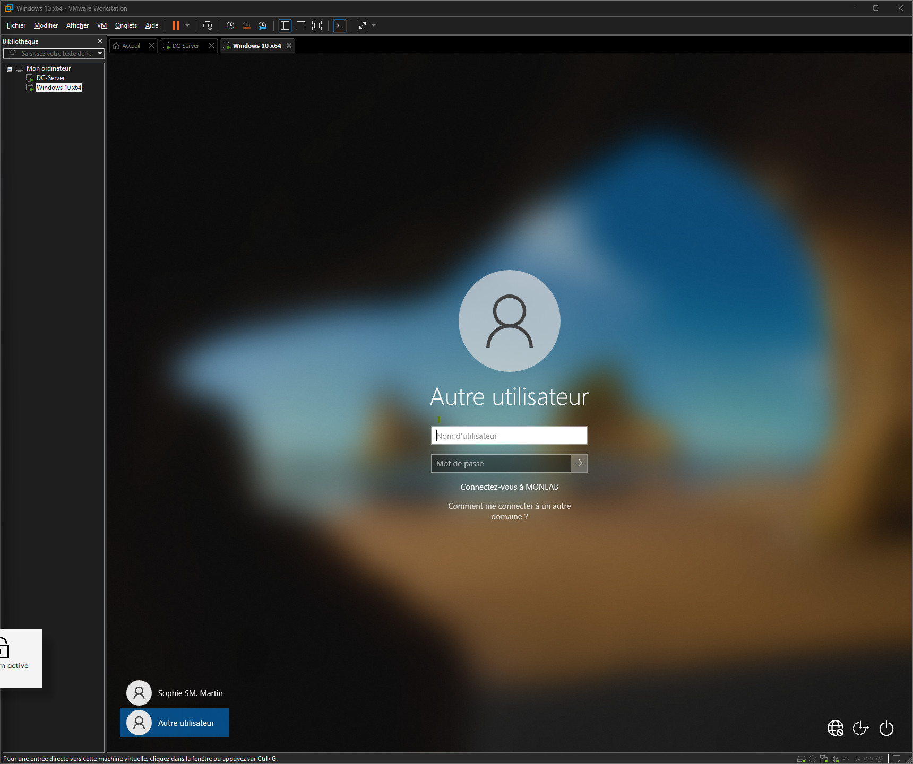
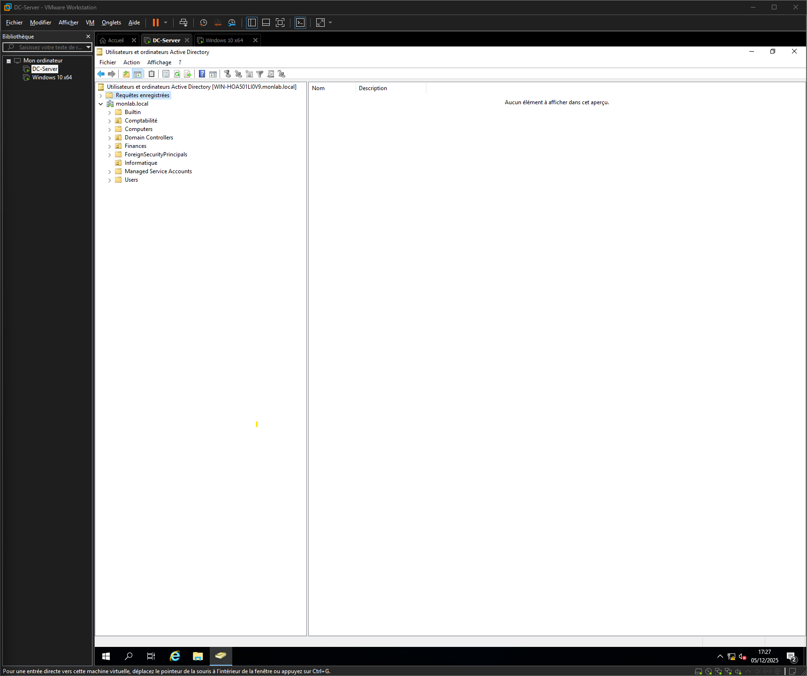
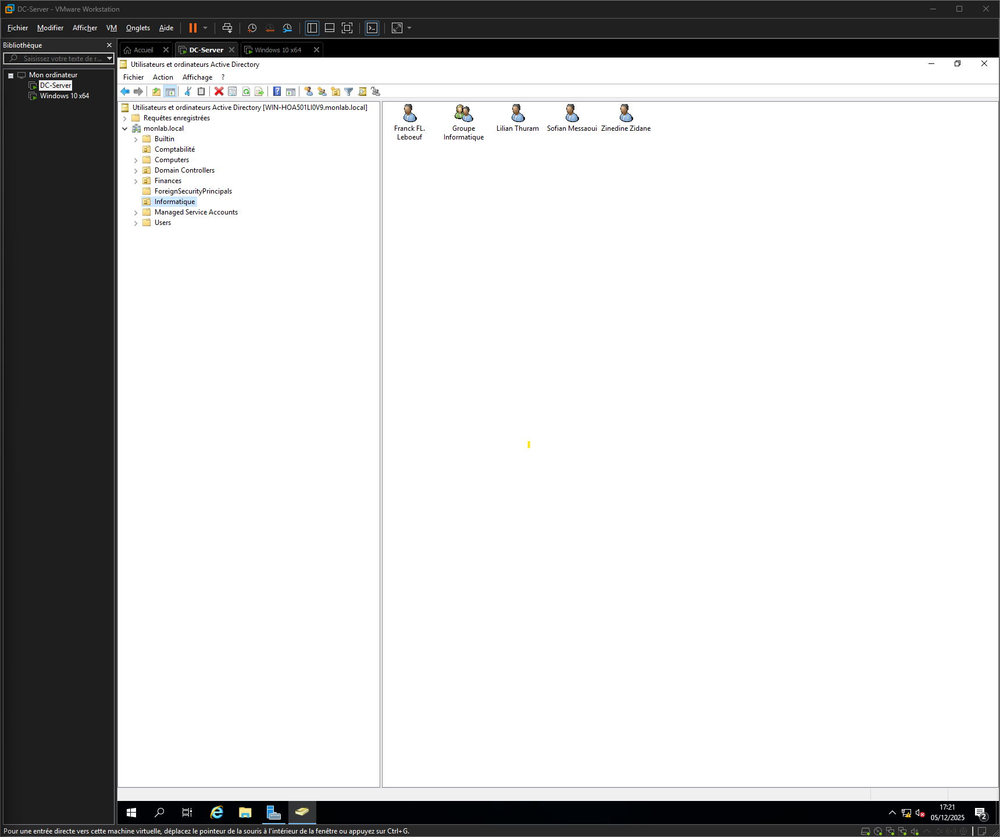
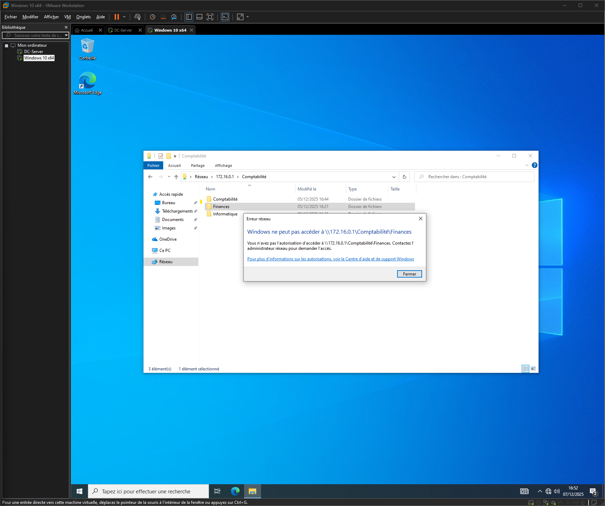

# Homelab Active Directory avec Windows Server 2019

## Introduction
Ce projet consiste à créer un environnement Active Directory complet en virtualisation pour apprendre l'administration système. J'ai construit une infrastructure réseau avec un contrôleur de domaine et des clients Windows 10, en utilisant VMware Workstation.
L'objectif est de comprendre comment fonctionnent les services d'annuaire dans un environnement professionnel, notamment la gestion centralisée des utilisateurs, des groupes et des permissions.

## Technologies utilisées:

VMware Workstation Player (virtualisation)
Windows Server 2019 Standard Evaluation
Windows 10 Professionnel
Active Directory Domain Services
DNS (Domain Name System)
DHCP (Dynamic Host Configuration Protocol)

Architecture réseau
L'infrastructure utilise une architecture à deux réseaux :
Serveur DC (Domain Controller)

Carte 1 (INTERNET) : Réseau NAT (VMnet8) pour l'accès Internet
Carte 2 (INTERNE) : Réseau Host-only (VMnet1, subnet 172.16.0.0/24) pour le réseau local

Client Windows 10

Carte unique : Réseau Host-only (VMnet1) connecté au réseau interne uniquement

Cette configuration permet d'isoler les clients sur un réseau privé sécurisé, tandis que le serveur peut accéder à Internet pour les mises à jour.

## Étape 1 : Installation de VMware Workstation
J'ai téléchargé VMware Workstation Pro depuis le site officiel de VMware. L'installation est simple et ne nécessite pas de licence pour un usage personnel et non commercial.

## Étape 2 : Configuration du Virtual Network Editor
Avant de créer les machines virtuelles, j'ai configuré les réseaux virtuels dans VMware pour correspondre à l'architecture souhaitée.
Dans le menu Edit, j'ai ouvert le Virtual Network Editor avec les droits administrateur. J'ai vérifié la présence de VMnet1 (Host-only) et configuré les paramètres suivants :

Type : Host-only
Subnet IP : 172.16.0.0
Masque : 255.255.255.0
DHCP : Désactivé (important car le serveur DC sera le serveur DHCP)
Adaptateur hôte : Décoché (pour éviter les conflits d'IP)

## Étape 3 : Installation de Windows Server 2019
J'ai créé une nouvelle machine virtuelle avec les spécifications suivantes :

Nom : DC-Server
Type : Windows Server 2019
RAM : 4 Go
Disque : 60 Go
Processeurs : 1 processeur, 2 cœurs
Firmware : BIOS (meilleure compatibilité)

Pour l'installation, j'ai téléchargé l'ISO de Windows Server 2019 Standard Evaluation (180 jours gratuits) depuis le site Microsoft Evaluation Center. Il est important de choisir la version "Desktop Experience" pour avoir l'interface graphique.
Pendant l'installation, j'ai sélectionné "Custom: Install Windows only (advanced)" et laissé Windows créer automatiquement les partitions sur le disque.
Le mot de passe administrateur défini est Password1! (à changer en production réelle).

## Étape 4 : Configuration réseau du serveur
Une fois Windows Server installé, j'ai configuré les deux cartes réseau.
Pour y accéder rapidement, j'ai utilisé la commande Windows + R puis tapé ncpa.cpl.
J'ai renommé les cartes pour plus de clarté :

Ethernet0 renommé en INTERNET
Ethernet1 renommé en INTERNE

Configuration carte INTERNET (NAT)

Laisser en DHCP automatique
Cette carte reçoit une IP de VMware (192.168.x.x)
Elle permet au serveur d'accéder à Internet

Configuration carte INTERNE (Host-only)

IP : 172.16.0.1
Masque : 255.255.255.0
Passerelle : Vide (le serveur est lui-même la passerelle)
DNS : 127.0.0.1 (le serveur est son propre DNS)

J'ai vérifié la configuration avec la commande ipconfig /all dans l'invite de commandes.

## Étape 5 : Installation d'Active Directory Domain Services
Active Directory est le service qui permet de gérer les utilisateurs, les ordinateurs et les ressources de manière centralisée dans le domaine.
Dans Server Manager, j'ai cliqué sur "Add roles and features" et sélectionné :

Installation type : Role-based
Server : Mon serveur (WIN-XXXXXXX)
Server Roles : Active Directory Domain Services
J'ai ajouté les features requises quand demandé
Lancé l'installation

Après l'installation du rôle, j'ai cliqué sur le drapeau jaune en haut à droite de Server Manager pour promouvoir le serveur en contrôleur de domaine.
Configuration du domaine

Déploiement : Ajouter une nouvelle forêt
Nom de domaine racine : monlab.local
Niveau fonctionnel : Windows Server 2016
Services : DNS et Catalogue global cochés
Mot de passe DSRM : Password1! (pour la récupération d'urgence)
Nom NetBIOS : MONLAB (généré automatiquement)

L'installation a pris environ 10 à 15 minutes. Le serveur a redémarré automatiquement.
Après le redémarrage, l'écran de connexion montre maintenant MONLAB\Administrator, confirmant que le domaine est actif.

## Étape 6 : Configuration de DHCP
Le serveur DHCP distribue automatiquement les adresses IP aux clients du réseau.
J'ai installé le rôle DHCP depuis Server Manager en suivant le même processus que pour Active Directory.
Une fois installé, j'ai ouvert le gestionnaire DHCP (Tools > DHCP) et configuré une nouvelle étendue :

Nom : Réseau Interne
Plage d'adresses : 172.16.0.100 à 172.16.0.200 (101 adresses disponibles)
Masque : 255.255.255.0
Durée du bail : 8 jours
Routeur (passerelle) : 172.16.0.1
Serveur DNS : 172.16.0.1

Important : J'ai autorisé le serveur DHCP dans Active Directory en faisant un clic droit sur le nom du serveur dans le gestionnaire DHCP et en sélectionnant "Authorize". La flèche verte indique que le serveur est autorisé et actif.

## Étape 7 : Installation du client Windows 10
J'ai créé une deuxième machine virtuelle pour le client :

Nom : Client1
Type : Windows 10
RAM : 4 Go
Disque : 40 Go
Réseau : UNE SEULE carte sur VMnet1 (Host-only)

Il est important que le client soit uniquement sur le réseau interne pour recevoir son IP du serveur DC.
Après l'installation de Windows 10, j'ai vérifié avec ipconfig /all que le client reçoit bien :

Une IP entre 172.16.0.100 et 172.16.0.200
Le serveur DHCP : 172.16.0.1
Le serveur DNS : 172.16.0.1

J'ai testé la connectivité avec ping 172.16.0.1 et nslookup monlab.local. Les deux commandes doivent fonctionner avant de joindre le domaine.

## Étape 8 : Jointure du client au domaine
Sur le client Windows 10, j'ai fait un clic droit sur "This PC" puis "Properties". Dans la fenêtre des propriétés système, j'ai cliqué sur "Change settings" puis "Change".
J'ai sélectionné "Domain" et saisi monlab.local. Windows a demandé les identifiants d'un compte autorisé à joindre le domaine. J'ai utilisé :

Nom d'utilisateur : Administrator
Mot de passe : Password1!

Un message de bienvenue "Welcome to the monlab.local domain" confirme le succès. Après le redémarrage, l'écran de connexion affiche maintenant "Other user" avec le domaine MONLAB.
Dans Active Directory Users and Computers sur le serveur, l'ordinateur apparaît maintenant dans le conteneur "Computers".

## Étape 9 : Création des Unités d'Organisation
Les Organizational Units (OU) permettent d'organiser les utilisateurs et les ressources de manière logique, par département par exemple.
Dans Active Directory Users and Computers, j'ai fait un clic droit sur monlab.local puis New > Organizational Unit.
J'ai créé trois OU :

Comptabilité
Finances
Informatique

J'ai laissé cochée la protection contre la suppression accidentelle pour chaque OU.

## Étape 10 : Création des utilisateurs
J'ai créé 10 utilisateurs répartis dans les trois départements.
Pour créer un utilisateur, j'ai cliqué sur l'OU concernée, puis clic droit > New > User.
Département Comptabilité (3 utilisateurs)

Sophie Martin (smartin)
Pierre Dubois (pdubois)
Julie Lefebvre (jlefebvre)

Département Finances (3 utilisateurs)

Thomas Bernard (tbernard)
Marie Durand (mdurand)
Lucas Petit (lpetit)

Département Informatique (4 utilisateurs)

Franck Leboeuf (fleboeuf)
Zinedine Zidane
Sofian Messaoui
Lilian Thuram

Pour simplifier l'apprentissage, j'ai configuré tous les comptes avec :

Mot de passe : Password1!
Option "Password never expires" cochée
Option "User must change password at next logon" décochée

En environnement professionnel, on forcerait le changement de mot de passe à la première connexion et on appliquerait une politique de complexité stricte.

## Étape 11 : Création des groupes de sécurité

Les groupes de sécurité permettent de gérer les permissions de manière efficace. Au lieu de donner des droits à chaque utilisateur individuellement, on donne des droits au groupe et on ajoute les utilisateurs au groupe.
J'ai créé un groupe dans chaque OU (clic droit sur l'OU > New > Group) :

Groupe Comptabilité (dans l'OU Comptabilité)
Groupe Finances (dans l'OU Finances)
Groupe Informatique (dans l'OU Informatique)

Pour chaque groupe :

Group scope : Global
Group type : Security

## Étape 12 : Ajout des utilisateurs aux groupes
J'ai ouvert les propriétés de chaque groupe (double-clic) et suis allé dans l'onglet "Members".
En cliquant sur "Add", j'ai pu ajouter les utilisateurs du département au groupe correspondant.
Pour gagner du temps, on peut ajouter plusieurs utilisateurs en une fois en séparant les noms par des points-virgules. Par exemple : "Thomas Bernard; Marie Durand; Lucas Petit"
Après validation avec "Check Names", tous les utilisateurs sont ajoutés au groupe.
Résultat final :

Groupe Comptabilité contient Sophie, Pierre et Julie
Groupe Finances contient Thomas, Marie et Lucas
Groupe Informatique contient Zinedine, Sofian, Lilian et Franck

## Étape 13 : Création des dossiers partagés
Sur le serveur DC, j'ai créé une structure de dossiers pour les partages réseau.
Dans C:, j'ai créé un dossier "Partages" contenant trois sous-dossiers :

Comptabilité
Finances
Informatique

Pour tester l'accès ultérieurement, j'ai placé un fichier texte dans chaque dossier.

## Étape 14 : Configuration des partages et permissions
Pour chaque dossier, j'ai configuré deux niveaux de permissions : les permissions de partage et les permissions NTFS (sécurité).
Configuration du partage (exemple pour Comptabilité)
Clic droit sur le dossier > Properties > onglet Sharing > Advanced Sharing

Cocher "Share this folder"
Share name : Comptabilité
Cliquer sur Permissions
Supprimer "Everyone"
Ajouter "Groupe Comptabilité"
Donner les permissions "Change" et "Read"

Configuration des permissions NTFS
Dans l'onglet Security :

Cliquer sur Advanced
Désactiver l'héritage (Disable inheritance)
Choisir "Convert inherited permissions into explicit permissions"
Supprimer le groupe "Users"
Ajouter "Groupe Comptabilité" avec la permission "Modify"

J'ai répété ces étapes pour les dossiers Finances et Informatique en remplaçant le groupe par le groupe correspondant.

## Étape 15 : Tests d'accès depuis le client
Pour valider que les permissions fonctionnent correctement, j'ai testé l'accès aux partages depuis le client Windows 10.
Test avec Sophie Martin (Comptabilité)
Connecté en tant que smartin sur le client, j'ai ouvert l'Explorateur Windows et tapé dans la barre d'adresse : \172.16.0.1\Comptabilité
Le dossier s'ouvre et je peux voir et modifier les fichiers. C'est normal, Sophie fait partie du Groupe Comptabilité.
En revanche, quand j'essaye d'accéder à \172.16.0.1\Finances, j'obtiens un message "Access Denied". C'est exactement ce qu'on veut : Sophie ne peut pas accéder aux dossiers des autres départements.
Test avec Thomas Bernard (Finances)
Après déconnexion et connexion avec tbernard, j'ai pu accéder au dossier Finances mais pas aux dossiers Comptabilité ni Informatique.
Ces tests confirment que la séparation des accès par département fonctionne correctement.

## Problèmes rencontrés et solutions
Conflit d'adresses IP
Au début, le serveur DC affichait l'IP 172.16.0.1 "en double". Cela était dû à l'option "Connecter un hôte et un adaptateur virtuel" activée dans VMnet1. En décochant cette option dans le Virtual Network Editor, le conflit a été résolu.
Client recevant une mauvaise IP
Le client Windows 10 recevait une IP 192.168.116.x au lieu de 172.16.0.x. Le problème venait de deux sources :

La carte réseau du client était sur VMnet8 (NAT) au lieu de VMnet1 (Host-only)
Le DHCP de VMware était activé sur VMnet1 et entrait en conflit avec le DHCP du serveur DC

La solution a été de vérifier la configuration de la carte dans VMware et de désactiver le DHCP VMware pour VMnet1.
Ordre de démarrage
Il est important de toujours démarrer le serveur DC avant les clients. Si le serveur n'est pas allumé, les clients ne peuvent pas obtenir d'adresse IP via DHCP et ne peuvent pas résoudre les noms de domaine via DNS.

## Compétences acquises

Ce projet m'a permis d'apprendre et de mettre en pratique :

Installation et configuration de Windows Server 2019
Déploiement d'Active Directory Domain Services
Configuration de services réseau (DNS, DHCP)
Gestion des utilisateurs et des groupes dans Active Directory
Configuration de partages réseau sécurisés
Gestion des permissions NTFS et de partage
Troubleshooting réseau (ping, ipconfig, nslookup)
Architecture réseau à plusieurs segments
Virtualisation avec VMware Workstation

Ces compétences sont essentielles pour un poste d'administrateur système, car Active Directory est utilisé dans la majorité des entreprises pour gérer leur infrastructure IT.
Améliorations futures possibles
Pour enrichir ce homelab, je pourrais ajouter :

Configuration de Group Policy Objects (GPO) pour appliquer des paramètres automatiquement
Mise en place de scripts PowerShell pour créer des utilisateurs en masse
Ajout d'un serveur de fichiers dédié
Configuration de Windows Server Update Services (WSUS)
Intégration d'un serveur Ubuntu pour pratiquer Linux dans un environnement Active Directory
Mise en place de sauvegardes automatiques
Configuration de quotas sur les dossiers partagés

## Conclusion
Ce projet m'a donné une compréhension pratique et concrète de la gestion d'infrastructure Active Directory. J'ai pu voir comment les concepts théoriques s'appliquent dans un environnement réel et comment résoudre les problèmes qui surviennent lors de la mise en place d'une telle infrastructure.
